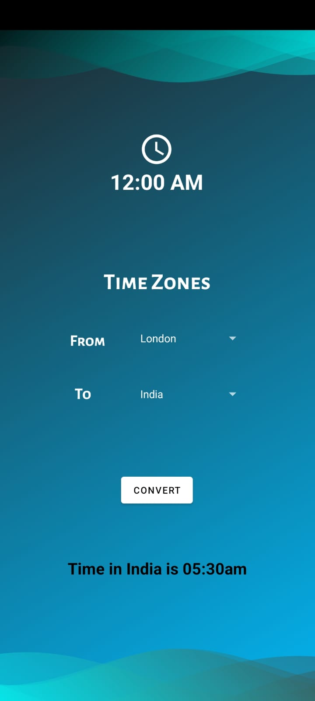

## TimeZone Converter

- Simple time zone converter utility to convert between your local time and any time around the world.

- Used JAVA for implementing the back-end Logic of timezone conversions.

- Designed user interfaces that engaged multiple screens using Android Studio.

- Tech Stack : Android Studio, Java, XML

### Screenshot
 